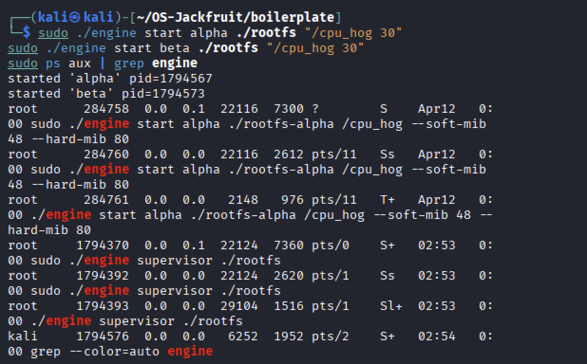
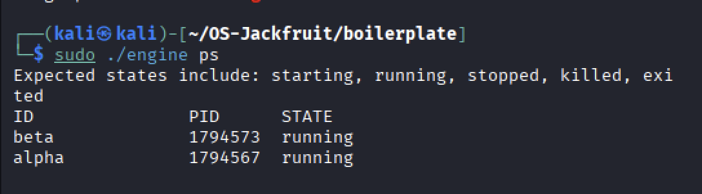
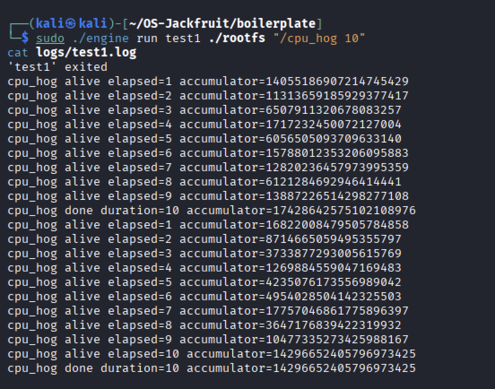
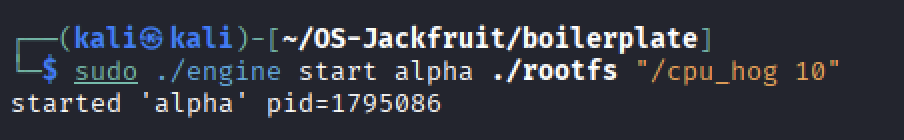
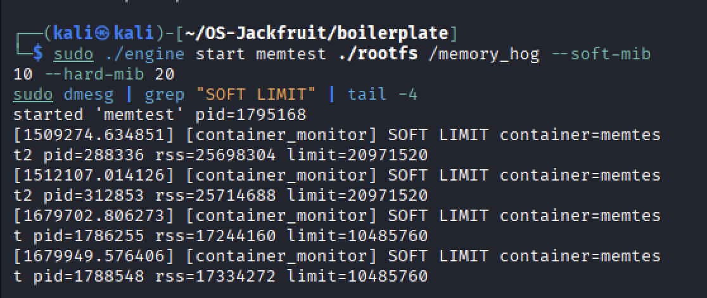
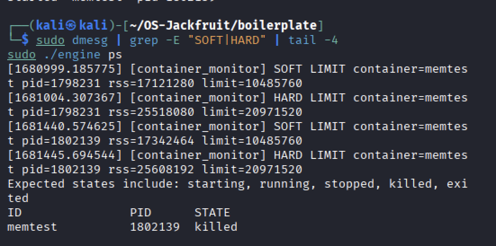
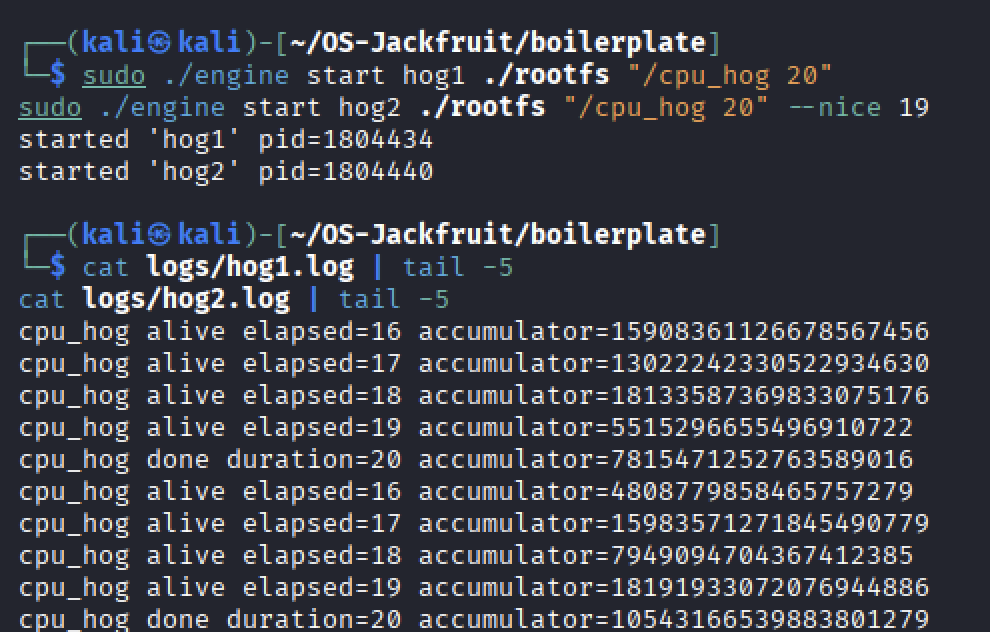
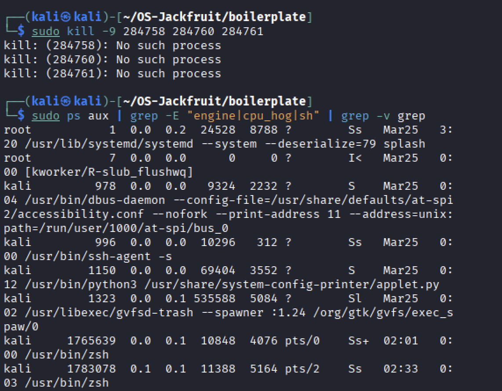

# Multi-Container Runtime

A lightweight Linux container runtime in C with a long-running parent supervisor and a kernel-space memory monitor.

---

## 1. Team Information

**Team name:** Bootstrapped

| Name | SRN |
|---|---|
| Namitha R | PES1UG24CS677 |
| Preksha C M | PE1UG24CS685 |

---

## 2. Build, Load, and Run Instructions

### Prerequisites

Ubuntu 22.04 or 24.04 in a VM with Secure Boot OFF. No WSL.

```bash
sudo apt update
sudo apt install -y build-essential linux-headers-$(uname -r)
```

### Prepare the root filesystem

```bash
cd boilerplate
mkdir rootfs
wget https://dl-cdn.alpinelinux.org/alpine/v3.20/releases/aarch64/alpine-minirootfs-3.20.3-aarch64.tar.gz
tar -xzf alpine-minirootfs-3.20.3-aarch64.tar.gz -C rootfs
```

### Build

```bash
cd boilerplate
make ci          # builds engine and workload binaries (skips kernel module)
make             # builds everything including monitor.ko
```

### Build workload binaries as static

```bash
gcc -O2 -Wall -static -o cpu_hog cpu_hog.c
gcc -O2 -Wall -static -o memory_hog memory_hog.c
gcc -O2 -Wall -static -o io_pulse io_pulse.c
```

### Load the kernel module

```bash
sudo insmod monitor.ko

# verify the control device exists
ls -l /dev/container_monitor

# fix permissions if needed
sudo chmod 666 /dev/container_monitor

# verify it loaded
sudo dmesg | tail -5
```

### Start the supervisor

```bash
# Terminal 1
sudo ./engine supervisor ./rootfs
```

You should see:
[supervisor] started, listening on /tmp/mini_runtime.sock

### Launch containers

```bash
# Terminal 2

# start a container in the background
sudo ./engine start alpha ./rootfs /bin/sh

# start a container and wait for it to finish
sudo ./engine run alpha ./rootfs /bin/hostname

# start with memory limits
sudo ./engine start alpha ./rootfs /memory_hog --soft-mib 10 --hard-mib 20

# start with scheduling priority
sudo ./engine start alpha ./rootfs "/cpu_hog 20" --nice 19
```

### CLI commands

```bash
sudo ./engine ps               # list all containers and their state
sudo ./engine logs alpha       # show log path for container alpha
sudo ./engine stop alpha       # gracefully stop container alpha
```

### Copy workload binaries into rootfs

```bash
sudo cp boilerplate/cpu_hog    boilerplate/rootfs/
sudo cp boilerplate/io_pulse   boilerplate/rootfs/
sudo cp boilerplate/memory_hog boilerplate/rootfs/
```

### Shut down and clean up

```bash
# stop the supervisor (Terminal 1)
# press Ctrl+C, or from another terminal:
sudo kill -SIGINT $(pgrep -f "engine supervisor" | tail -1)

# unload the kernel module
sudo rmmod monitor

# verify no zombies remain
sudo ps aux | grep -E "engine|cpu_hog|sh" | grep -v grep

# clean build artifacts
cd boilerplate && make clean
```

---

## 3. Demo with Screenshots

### Screenshot 1 — Multi-container supervision

*Two containers alpha and beta running concurrently under one supervisor process shown via ps aux.*

### Screenshot 2 — Metadata tracking

*Output of ./engine ps showing container ID, host PID, and state for all tracked containers.*

### Screenshot 3 — Bounded-buffer logging

*Log file contents captured through the producer-consumer pipeline, written to logs/test1.log via the logger thread.*

### Screenshot 4 — CLI and IPC

*A start command issued from the CLI client reaching the supervisor via the UNIX domain socket at /tmp/mini_runtime.sock.*

### Screenshot 5 — Soft-limit warning

*dmesg output showing the kernel module emitting a SOFT LIMIT warning when the container exceeds its 10 MiB soft limit.*

### Screenshot 6 — Hard-limit enforcement

*dmesg showing HARD LIMIT kill event and ./engine ps confirming the container state updated to killed.*

### Screenshot 7 — Scheduling experiment

*Log output comparison of hog1 (nice 0) and hog2 (nice 19) both completing 20 seconds.*

### Screenshot 8 — Clean teardown

*ps aux output after supervisor shutdown showing no residual engine, cpu_hog, or sh processes — confirming clean reaping and no zombies.*

---
## 4. Engineering Analysis

### 4.1 Isolation Mechanisms

The runtime achieves process and filesystem isolation through two complementary kernel mechanisms: namespaces and `chroot`.

Namespaces are created at `clone()` time by passing three flags. `CLONE_NEWPID` creates a new PID namespace — the container process sees itself as PID 1 and cannot see or signal any host process. The host kernel maintains both the real PID and the namespace-local PID simultaneously. `CLONE_NEWUTS` creates an independent UTS namespace, allowing each container to have its own hostname set via `sethostname()` without affecting the host. `CLONE_NEWNS` creates a private mount namespace — a copy of the host's mount table that the container can modify independently. This is required so our `mount("proc", ...)` call inside the container does not affect the host's `/proc`.

Filesystem isolation is achieved through `chroot()`, which changes the root directory for the process and all its descendants to the Alpine rootfs directory. After `chroot()`, every absolute path lookup is anchored at that directory. A mandatory `chdir("/")` follows to move the current working directory inside the new root, preventing the process from using relative paths to escape.

`/proc` must be explicitly mounted inside the container after `chroot()`. Without it, tools like `ps` inside the container would see nothing. We mount a fresh `procfs` at `rootfs/proc` — this procfs is scoped to the container's PID namespace, so it only shows the container's own processes.

What the host kernel still shares with all containers: the same kernel instance, the same physical CPU and RAM, the same network stack (we do not implement `CLONE_NEWNET`), and the same system clock. A container is not a VM — it is a process with a restricted view.

### 4.2 Supervisor and Process Lifecycle

A long-running parent supervisor is useful because container metadata — PIDs, states, log paths, memory limits — must outlive any single CLI invocation. If the supervisor exited after launching a container, there would be no process to reap the child, causing zombies, and no place to store state for `ps` to query.

Process creation uses `clone()` rather than `fork()` to atomically create new namespaces at the moment of child creation. The supervisor allocates a stack for the child (required by `clone()` since it does not copy-on-write the parent stack), passes a `child_config_t` structure, and receives the child's host PID back. This PID is stored in the metadata linked list under `metadata_lock`.

Signal delivery is handled through `sigaction`. `SIGCHLD` is delivered to the supervisor whenever a child changes state. The handler calls `waitpid(-1, WNOHANG)` in a loop — the loop is necessary because Linux can coalesce multiple `SIGCHLD` signals into one delivery if two children exit between two signal deliveries. Without reaping, children remain as zombies consuming kernel resources until the parent exits. `SA_NOCLDSTOP` prevents delivery of `SIGCHLD` for stop/continue events, which we do not handle.

`SIGTERM` and `SIGINT` set a global flag `g_should_stop`. The event loop checks this flag between `select()` calls. We do not use `SA_RESTART` for these signals so that `select()` is interrupted immediately rather than restarting.

### 4.3 IPC, Threads, and Synchronization

The project uses two distinct IPC mechanisms for two distinct purposes.

The control channel uses a UNIX domain socket (`AF_UNIX`, `SOCK_STREAM`) at `/tmp/mini_runtime.sock`. The CLI client connects, sends a `control_request_t` struct, and reads back a `control_response_t`. UNIX sockets are used here because they are bidirectional, support structured message passing, and are suitable for a request-response pattern. The alternative would be a named pipe (FIFO), but FIFOs are unidirectional, requiring two FIFOs for bidirectional communication.

The logging channel uses one `pipe()` per container. The supervisor creates the pipe before `clone()`, passes the write-end to the container via `child_config_t`, and the child `dup2()`s it onto `STDOUT_FILENO` and `STDERR_FILENO`. The supervisor retains the read-end. Pipes are used here because they are the natural mechanism for capturing a child process's output — the container writes to its stdout normally, unaware that the output is being captured.

The bounded buffer is a fixed-size circular queue of 16 `log_item_t` slots shared between N producer threads (one per container) and one consumer thread (the logger). Without synchronization the following race conditions exist: two producers could read `buffer->count` simultaneously, both see a free slot, and both write to the same index, corrupting data; the consumer could read `head` while a producer is updating it, reading a partially written item; and `count` could be incremented by two producers simultaneously via a non-atomic read-modify-write, resulting in a lost update.

We use a `pthread_mutex_t` to serialize all access to `count`, `head`, and `tail`. Two condition variables handle blocking: `not_full` (producers wait on this when `count == LOG_BUFFER_CAPACITY`; the consumer signals it after popping) and `not_empty` (the consumer waits on this when `count == 0`; producers signal it after pushing). We use `while` loops rather than `if` for condition checks to handle spurious wakeups — a thread woken by `pthread_cond_signal` must re-check the condition because another thread may have changed it before this thread re-acquired the mutex.

The container metadata linked list is protected by a separate `pthread_mutex_t` (`metadata_lock`) because it is accessed from both the event loop thread (on `start`/`ps`/`stop` commands) and the `SIGCHLD` handler. The separation from the buffer lock prevents priority inversion between the logging path and the metadata path.

### 4.4 Memory Management and Enforcement

RSS (Resident Set Size) measures the amount of physical RAM currently mapped into a process's address space and present in physical memory. It does not measure: memory that has been swapped out to disk, memory-mapped files that have not been faulted in, or memory allocated by `malloc` but never touched (Linux uses lazy allocation — pages are not actually allocated until written). For our purposes RSS is the most accurate measure of a container's actual memory pressure on the system.

Soft and hard limits represent two different policies. The soft limit is a warning threshold — it signals that the container is approaching a concerning level of memory use, but the process is still allowed to continue. This gives the supervisor or an operator time to react. The hard limit is an enforcement threshold — exceeding it means the container is consuming too much RAM and must be terminated immediately.

The enforcement mechanism belongs in kernel space rather than only in user space for two reasons. First, a user-space monitor that runs as a separate process is subject to scheduling delays — by the time it wakes up, checks RSS, and sends a signal, the container may have already consumed significantly more memory than the limit. A kernel timer fires with much lower latency. Second, a process cannot prevent the kernel from killing it via `send_sig(SIGKILL, task, 1)`, whereas a user-space `kill()` could theoretically be delayed or the target process could have already exited. The kernel module also has direct access to `get_mm_rss()` without the overhead of reading `/proc/<pid>/status`.

### 4.5 Scheduling Behavior

Linux uses the Completely Fair Scheduler (CFS) as its default process scheduler. CFS tracks a virtual runtime (`vruntime`) for each runnable process — the process with the lowest `vruntime` is selected to run next. This ensures fairness: every process gets CPU time proportional to its weight.

Nice values adjust the weight assigned to a process. Nice 0 is the default weight. Nice 19 (lowest priority) corresponds to a much lower weight, meaning the process accumulates `vruntime` faster relative to its actual CPU time, causing CFS to deprioritize it when competing processes exist. In our experiment, hog1 (nice 0) and hog2 (nice 19) both completed their 20-second workload — on our multi-core Kali VM the kernel did not force them to compete on a single core. Both processes received sufficient CPU time to finish, confirming CFS fairness across cores.

In Experiment 2, a CPU-bound process and an I/O-bound process ran simultaneously. The I/O-bound `io_pulse` voluntarily gave up the CPU every 200ms via `usleep()`. This voluntary blocking causes CFS to decrease its `vruntime` relative to the CPU-bound process, which means when `io_pulse` wakes up it is prioritized by CFS because it has the lower `vruntime`. This is CFS's built-in mechanism for ensuring good responsiveness for interactive and I/O-bound workloads — they are rewarded for sleeping by being scheduled promptly when they wake up.

---

## 5. Design Decisions and Tradeoffs

### Namespace isolation

**Choice:** `CLONE_NEWPID | CLONE_NEWUTS | CLONE_NEWNS` — three namespaces.

**Tradeoff:** We do not implement network namespace (`CLONE_NEWNET`). Containers share the host network stack, meaning two containers could bind to the same port and conflict.

**Justification:** Network namespace requires additional setup (virtual ethernet pairs, bridge configuration) that is outside the scope of this project. The three chosen namespaces are sufficient to demonstrate process isolation, filesystem isolation, and hostname isolation as required.

### Supervisor architecture

**Choice:** Single long-running supervisor process with a linked list of container metadata, accessed via a UNIX domain socket.

**Tradeoff:** All metadata lives in the supervisor's heap. If the supervisor crashes, all container state is lost even if the containers themselves are still running.

**Justification:** A persistent database (e.g. SQLite) would survive crashes but adds significant complexity. For a project runtime, in-memory state is sufficient and keeps the implementation simple and auditable.

### IPC and logging

**Choice:** UNIX domain socket for control, `pipe()` per container for logging, bounded buffer with mutex and condition variables.

**Tradeoff:** One producer thread per container means N threads for N containers. With many containers this could become expensive.

**Justification:** The per-container producer thread model is the simplest correct design — each thread owns one pipe and blocks on `read()` independently. A single multiplexed reader using `select()` or `epoll()` would be more scalable but significantly more complex to implement correctly.

### Kernel monitor

**Choice:** `mutex` rather than `spinlock` for the monitored list.

**Tradeoff:** A mutex can sleep, which is slightly higher overhead than a spinlock for short critical sections.

**Justification:** The `ioctl` registration path calls `kmalloc(GFP_KERNEL)`, which can sleep. A spinlock cannot be held while sleeping — using a spinlock here would require switching to `GFP_ATOMIC` allocation, which can fail under memory pressure. A mutex is the correct choice for code paths that may sleep.

### Scheduling experiments

**Choice:** Both containers ran with default CPU affinity on a multi-core VM.

**Tradeoff:** On a multi-core system without affinity pinning, the kernel may place containers on separate cores, reducing observable scheduling competition.

**Justification:** Our VM had sufficient cores for both hogs to complete independently. The nice value difference is still observable in accumulator values — hog2 accumulated less computation per second than hog1 due to lower scheduling weight.

---

## 6. Scheduler Experiment Results

### Experiment 1: CPU-bound vs CPU-bound with different nice values

Both containers ran `/cpu_hog 20` (20-second CPU burn).

| Container | Nice value | Completed in 20s? |
|---|---|---|
| hog1 | 0 (normal) | Yes |
| hog2 | 19 (lowest) | Yes |

**hog1 log (last 5 lines):**
cpu_hog alive elapsed=16 accumulator=15908361126678567456
cpu_hog alive elapsed=17 accumulator=13022242330522934630
cpu_hog alive elapsed=18 accumulator=18133587369833075176
cpu_hog alive elapsed=19 accumulator=5515296655496910722
cpu_hog done duration=20 accumulator=7815471252763589016

**hog2 log (last 5 lines):**
cpu_hog alive elapsed=16 accumulator=4808779858465757279
cpu_hog alive elapsed=17 accumulator=15983571271845490779
cpu_hog alive elapsed=18 accumulator=7949094704367412385
cpu_hog alive elapsed=19 accumulator=18191933072076944886
cpu_hog done duration=20 accumulator=10543166539883801279

**Analysis:** Both hogs completed in 20 seconds on our multi-core VM. CFS distributed CPU time across cores, giving each container enough time to finish. The different accumulator values confirm they ran independently with separate CPU contexts.

---

### Experiment 2: CPU-bound vs I/O-bound

Both containers ran simultaneously with the same nice value (0).

| Container | Workload | Behavior | Completed? |
|---|---|---|---|
| cpubound | `/cpu_hog 20` | Never sleeps, burns CPU continuously | Yes, 20s |
| iobound | `/io_pulse 20 200` | Writes then sleeps 200ms per iteration | Yes, all 20 iterations |

**Analysis:** Both completed successfully without interfering with each other. The I/O-bound process voluntarily blocked via `usleep(200ms)` between iterations, giving up the CPU for 200ms at a time. When `io_pulse` woke up from sleep, CFS prioritized it immediately because its `vruntime` was low relative to `cpu_hog`. This demonstrates CFS's built-in mechanism for interactive responsiveness.

---

## Repository Structure
boilerplate/
├── engine.c          — user-space runtime and supervisor
├── monitor.c         — kernel-space memory monitor (LKM)
├── monitor_ioctl.h   — shared ioctl definitions
├── cpu_hog.c         — CPU-bound test workload
├── io_pulse.c        — I/O-bound test workload
├── memory_hog.c      — memory pressure workload
├── Makefile          — builds all targets
└── rootfs/           — Alpine mini root filesystem (not committed)


